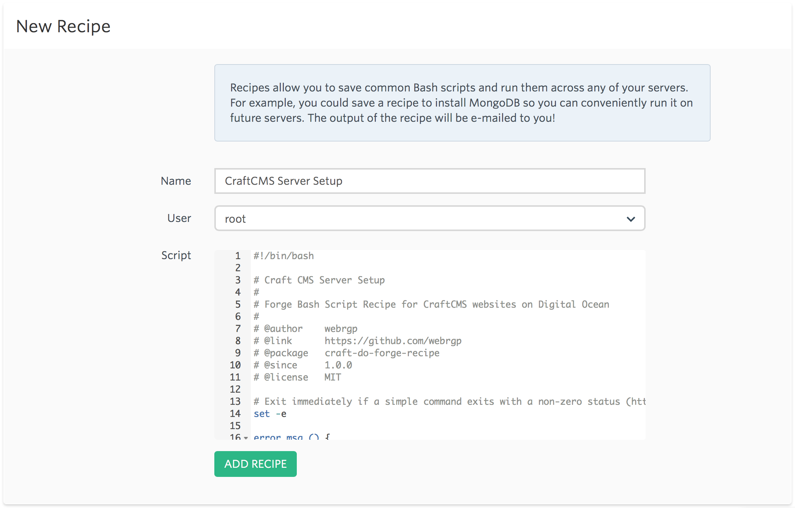
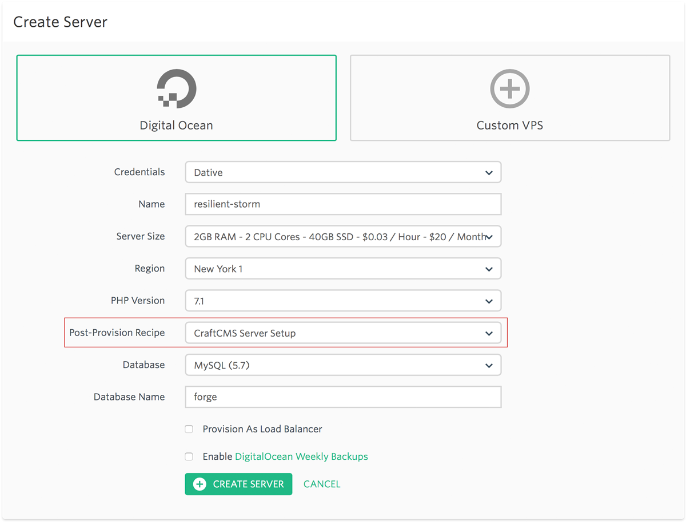

# Craft-DO-Forge-Recipe

[CraftCMS](https://craftcms.com) / [Digital Ocean](https://digitalocean.com) / [Laravel Forge](http://forge.laravel.com) Recipe.

Digital Ocean / Forge Recipe for CraftCMS websites heavily inspired by [nystudio107's](https://nystudio107.com) [craft-script](https://github.com/nystudio107/craft-scripts), [nginx-craft](https://github.com/nystudio107/nginx-craft) and their various articles.

*Special thanks to [Andrew Welch](https://github.com/khalwat) for all his help and guidance.*

## Overview

### What it does

The `craft_do_forge_recipe.sh` perform the following:

- Install Digital Ocean [Monitoring tools](https://www.digitalocean.com/community/tutorials/how-to-install-and-use-the-digitalocean-agent-for-monitoring)
- Fix mysql 5.7.5+ [issue]( https://craftcms.stackexchange.com/questions/12084/getting-this-sql-error-group-by-incompatible-with-sql-mode-only-full-group-by/12106 )
- Install `jpegoptim` & `optipng` per nystudio107's [Creating Optimized Images in Craft CMS ](https://nystudio107.com/blog/creating-optimized-images-in-craft-cms) article
- Add the [nginx partials](https://github.com/nystudio107/nginx-craft/tree/master/nginx-partials) to `/etc/nginx`

### Assumptions made

The script assumes a few things:

- You use [Laravel Forge](http://forge.laravel.com) to create and manage your server
- You use [Digital Ocean](https://digitalocean.com) as the sever provider
- You are using a Digital Ocean + Laravel Forge setup per [How Agencies & Freelancers Should Do Web Hosting](https://nystudio107.com/blog/web-hosting-for-agencies-freelancers) article
- You are running the recipe as `root`
- [nginx-craft](https://github.com/nystudio107/nginx-craft#assumptions-made) requirements

## Install Craft-DO-Forge-Recipe

1. Log into your [Laravel Forge](https://forge.laravel.com/auth/login) account
2. Click on [Recipes](https://forge.laravel.com/recipes)
3. Give the recipe a name. Example: `CraftCMS Server Setup`
4. Set the `User` to `root`
5. Paste the contents of [scripts/craft_do_forge_recipe.sh](https://github.com/webrgp/craft-do-forge-recipe/blob/master/scripts/craft_do_forge_recipe.sh) into `Script`
6. Click on **ADD RECIPE** button

## Using Craft-DO-Forge-Recipe

When you create a new server in Forge, set *Post Provition Recipe* to **CraftCMS Server Setup** (or whatever you named).

## Roadmap

- [ ] Add mozjpeg installation per [Installing mozjpeg on Ubuntu 16.04 (Forge)](https://nystudio107.com/blog/installing-mozjpeg-on-ubuntu-16-04-forge)